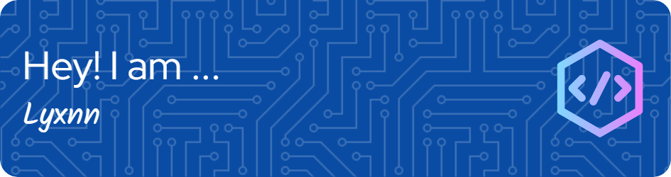

 

 

<h1>About Me:</h1>
Hello there! I am an engineering student, and I'm interested in mathematics, physics,  aerospace engineering, computer science in general, artificial intelligence, ethical hacking (I'm a big fan of TryHackMe) and a little game development. I speak and learn C/C++, Python, Java, JavaScript, and Rust.

<h1>GitHub Stats:</h1>

 

  
 

 

 

 

  
  
 

 

  
<h3 align="left">Languages and Tools I use:</h3>

